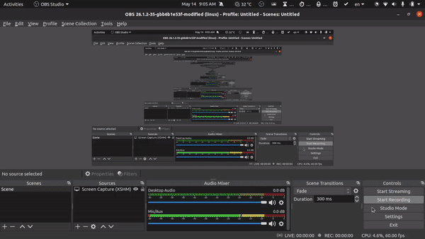

## Smart farm

A server of smart farm project, which controls numberous of iot devices, automate the farming process.

- [Getting Started](#getting-started)

## Getting Started

    $ git clone git@github.com:hsonthach/smartfarm.git
    $ cd smartfarm

    # Install the requirements
    $ pip install -r requirements.txt

    # Perform database migrations
    $ python manage.py makemigrations
    $ python manage.py migrate

    # Run server
    $ cd mysite
    $ python manage.py runserver

**NOTE**: We highly recommend creating a [Virtual Environment](http://docs.python-guide.org/en/latest/dev/virtualenvs/). Python Virtual Environments allow developers to work in isolated sandboxes and to create separation between python packages installed via [pip](https://pypi.python.org/pypi/pip).

